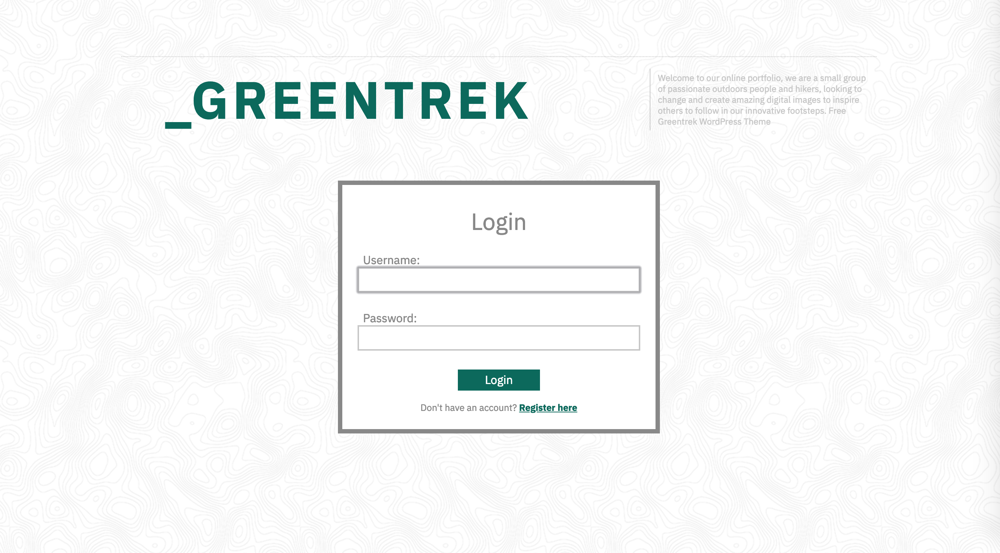

# GREENTREK: Express Photo Gallery

A Content Management System (CMS) for hiking enthusiasts built on an Express server in a Docker container.

## Features

- Full authentication & Password encryption
- Full error handling w/ error messages
- Session Management
- Responsive Web Design

## Technologies & Frameworks

* Express
* Express Session
* Redis
* Express Handlebars
* Passport.js
* Bcryptjs
* Connect-flash
* Bookshelf.js
* Knex.js
* PostgreSQL
* Docker
* Sass
* Mocha
* Chai
* Supertest

## How to run?

You can play with a demo-version here: [Demo](ec2-52-37-169-120.us-west-2.compute.amazonaws.com)

## Screenshots

___

___

___

